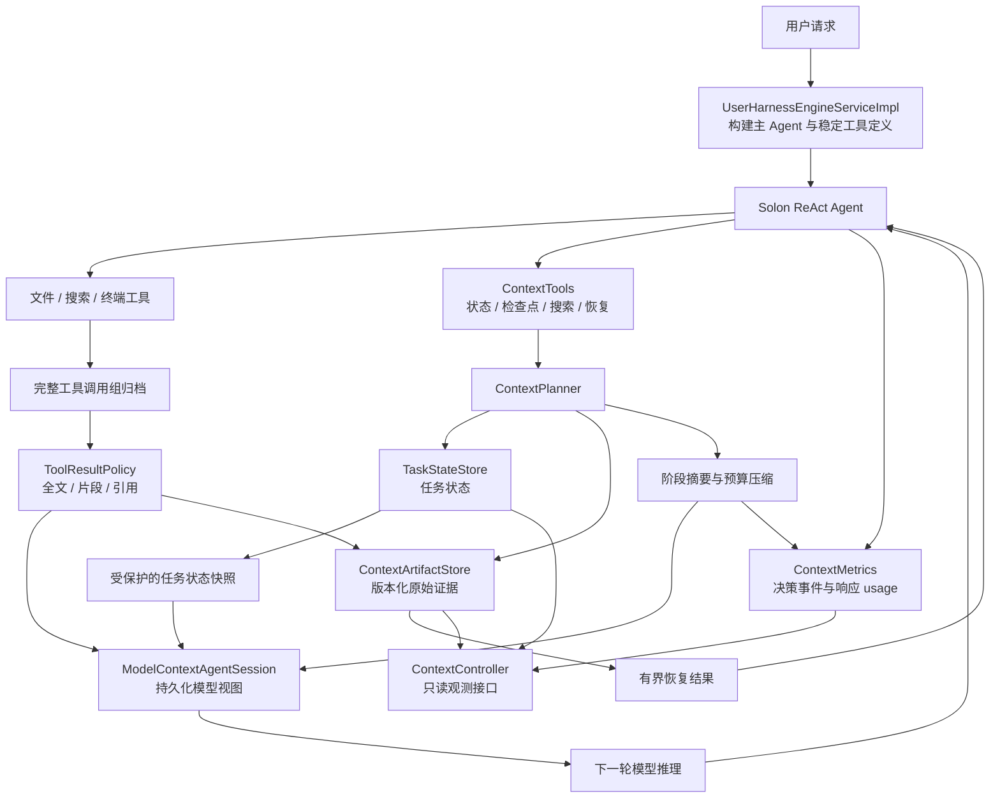
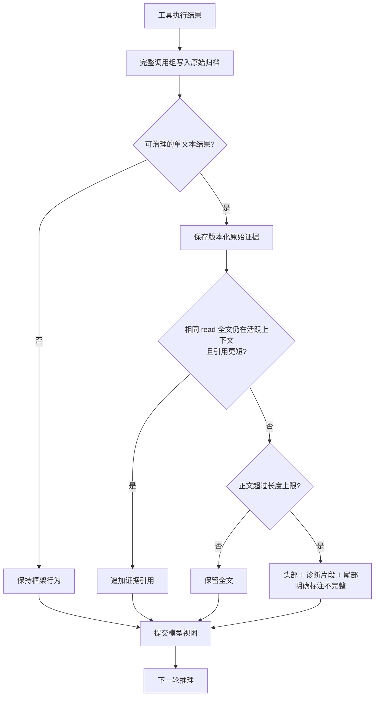

# UData Harness 长周期任务上下文管理：改造成果与架构

> 版本：第二批增量实现 · 日期：2026-09-30  
> 本文依据当前代码与测试结果编写。性能对照使用模拟模型；实际供应商费用和缓存收益尚未实测。

## 1. 改造成果

本次改造在现有 Solon AI Harness 之上，将上下文管理从“加载历史、超限后压缩”扩展为：

**原始记录归档 → 新工具结果治理 → 任务状态维护 → 阶段批量收敛 → 证据按需恢复 → 指标观测。**

核心目标是让低价值过程信息退出模型的活跃上下文，同时保留任务约束、阶段结论及可恢复的证据，并减少不必要的前缀变化。

| 能力 | 当前成果 |
| --- | --- |
| 持久化模型视图 | 完整历史与模型上下文分开保存，重启沿用摘要和保留消息 |
| 工具结果治理 | 长文本先归档；文件按源码顺序、日志按诊断优先级、搜索按完整匹配行提供有界片段 |
| 重复信息处理 | 同版本、同范围的文件全文仍在活跃上下文时，后续读取只追加引用 |
| 结构化任务状态 | 保存目标、验收条件、约束、阶段、决定、待办与证据引用 |
| 阶段收敛 | Agent 显式请求检查点，批量摘要旧历史，保留最新用户请求和近期完整工具组 |
| 按需恢复 | 通过关键词搜索和字符范围恢复，重新获取已退出上下文的证据 |
| Cache 感知 | 日常持续追加，阶段节点统一调整；记录实际响应中的缓存用量 |
| 压缩保护 | 最新用户请求原文与结构化待办保留；校验摘要形式及工具组完整性；失败回退 |
| 请求级用量 | 主推理与摘要调用分别记录；失败、流式取消及缺失用量可见 |
| 生命周期兼容 | 验证了跨轮、重启、审批暂停与恢复，以及会话隔离 |

当前已通过 **87 项测试，失败 0、错误 0、跳过 0**。

第二批增量重点是保护任务准确性和补齐观测。预算压缩只在内部临时建立“任务快照 + 最新用户请求”保护段；
未触发压缩时恢复原有消息顺序，成功压缩时再恢复用户请求与存活后续消息的相对顺序。
因此保护当前请求不会让它前面的所有历史也被永久保护，旧过程信息仍能退出。
待办和约束以结构化快照保留，不要求摘要重新生成一遍。
这依赖 Agent 正确维护任务状态；结构校验不能代替摘要语义或最终交付验收。

## 2. 原有问题与改造思路

长周期 Coding Agent 的上下文包含任务需求、代码、工具输出、搜索结果、测试日志和阶段讨论。其中很多信息只在短时间内有用，但会随历史持续进入后续请求。

原有机制存在两个主要问题：

1. 固定数量的历史加载会使请求前缀随窗口移动，历史恢复也可能绕过已生成的摘要。
2. 工具输出持续增长，通常等到预算压力出现后才统一压缩，重复和超长输出在此之前已经产生输入开销。

本次分两层解决：先建立可恢复的持久化模型视图，再治理进入模型视图的信息及其生命周期。

| 处理对象 | 原有方式 | 改造后的方式 |
| --- | --- | --- |
| 会话历史 | 按框架窗口加载 | 恢复当前模型视图，并追加尚未消费的归档消息 |
| 长工具结果 | 全文进入上下文，之后统一压缩 | 原文归档，模型先接收有界片段 |
| 重复文件读取 | 反复追加正文 | 检查版本、范围及当前可见性，再决定正文或引用 |
| 阶段切换 | 依赖后续容量压缩 | 更新任务状态，显式请求阶段检查点 |
| 历史恢复 | 依赖摘要或重新读文件 | 可搜索原始证据并恢复指定片段 |
| 优化判断 | 主要看上下文长度 | 同时观察请求载荷、压缩事件、恢复与供应商用量 |

## 3. 整体架构



`PersistentContextCompressionInterceptor` 是与框架生命周期连接的入口；`ContextPlanner` 负责治理和检查点逻辑。策略、证据存储、任务状态和指标分别实现，避免把所有能力集中在摘要算法中。

### 3.1 组件职责

| 组件 | 职责 |
| --- | --- |
| `UserHarnessEngineServiceImpl` | 装配策略、配置和主 Agent 工具，加入长任务操作指引 |
| `PersistentContextCompressionInterceptor` | 接入工具结束、推理开始、推理结束和 Agent 结束；保持原始工具组归档与模型视图持久化 |
| `ContextPlanner` | 调度新结果治理、执行上下文工具、维护状态快照、提交阶段检查点 |
| `ToolResultPolicy` | 根据工具类型、结果长度及活跃证据，选择全文、片段或引用 |
| `ContextArtifactStore` | 保存原始文本和版本信息，执行关键词搜索、完整性校验及范围恢复 |
| `TaskStateStore` | 校验并原子保存结构化任务状态 |
| `ModelContextAgentSession` | 保存模型视图、压缩代次及归档消费位置，跨轮和重启恢复 |
| `ContextMetrics` | 记录上下文决策、推理前消息结构及供应商报告的 Token / Cache 用量 |
| `ContextTools` | 提供六个稳定的上下文工具定义 |
| `ContextController` | 提供按会话归属隔离的只读报告、搜索与恢复接口 |

### 3.2 数据分层

```text
会话目录/
├── <sessionId>.messages.ndjson       完整原始消息与工具调用组
├── <sessionId>.model-context.json    当前模型视图、归档消费位置、压缩代次
└── <sessionId>.context/
    ├── artifacts/
    │   └── <sha256>.json             工具原始文本、参数、内容哈希、创建时间
    ├── task-state.json              最新结构化任务状态及 revision
    └── metrics.ndjson               治理、压缩、恢复和用量事件
```

三类信息各有用途：原始归档支持追溯，模型视图控制本轮输入，任务状态及证据支撑跨阶段继续工作。

模型视图保存 `archiveCursor`。恢复时先加载已提交的摘要和保留消息，再追加尚未消费的原始归档；不会因为重启就把已总结的全部历史重新装入。

视图、任务状态和单个证据文件采用临时文件写入后替换。它们是独立文件，不构成跨文件事务；归档消费位置用于处理尚未进入模型视图的追加消息。

## 4. 核心流程

### 4.1 工具结果进入上下文



治理覆盖 `read`、`grep`、`glob`、`ls`、`list`、`webfetch`、`websearch`、`codesearch`、`bash`、`bash_wait` 的非直返、单文本结果。

证据 ID 根据“工具名称 + 规范化参数 + 原始文本”计算。文件路径、读取范围或返回内容变化都会形成不同证据版本。

去重不会跳过实际工具执行，所以文件修改仍能被发现。它只减少模型收到的重复正文；如果旧全文已经退出上下文，或者只剩旧片段/引用，就再次提供正文。

长输出使用规则提取，不额外调用模型。模型收到的是明确标注的部分证据，附有证据 ID 和诊断字符位置；不能据此假定所有错误已经展示，必要时需要恢复遗漏内容。

#### 例子一：反复读取同一个文件

假设 `OrderService.java` 某个读取范围返回 2800 字符，未超过默认的 6000 字符上限。Agent 在分析和修改方案时连续读取四次：

| 步骤 | 文件与活跃上下文状态 | 新进入模型上下文的内容 |
| --- | --- | --- |
| 第一次读取 | 尚未读取该版本 | 2800 字符正文，登记证据版本 V1 |
| 第二次读取 | 内容和范围相同，V1 全文仍可见 | 一段指向 V1 的简短引用 |
| 第三次读取 | 内容和范围相同，V1 全文仍可见 | 继续追加引用 |
| 第四次读取 | 文件已经修改，返回内容不同 | 新版本 V2 的正文 |

改造前，前三次相同正文都会累积；改造后只保留第一次全文和后续引用。第四次读取会正常执行并提供新版本，不会因为路径相同而误用旧代码。

还有两个边界：如果检查点已经将 V1 全文移出上下文，再次读取 V1 会重新提供正文；如果正文只有几十个字符，比引用还短，就直接保留正文。

以上字符量是说明策略的假设，不是性能测试数据。对于超过上限的文件，首次提供的是片段；只剩片段时不会按“已有全文”省略下一次读取。

#### 例子二：测试产生大量日志

假设一次测试返回 50000 字符，其中前部是运行环境，中间有错误，尾部是测试统计。原始日志全部归档，下一轮推理接收不超过配置上限的投影，例如：

```text
[Partial tool output; 50000 original characters. Artifact: <真实证据 ID>.
 Use context_restore(id, offset, maxChars) to recover omitted evidence.]

Starting OrderServiceTest ...
...头部片段...

[omitted middle; diagnostic excerpts below]
[offset 18420] ERROR MissingSymbol in OrderService.java
[offset 18610] Caused by: unresolved method findOrders(...)

[omitted; tail follows]
Tests run: 59, Failures: 1
BUILD FAILURE
```

这是简化展示，证据 ID 和 offset 均为示意。实际模型输出保留原日志中的文字，诊断位置按字符计数。

Agent 可以先定位 `MissingSymbol`，再恢复报错周边的详细堆栈。这里没有将日志概括成“测试失败，原因已确定”，也没有保证所有诊断行都能容纳进片段；遗漏内容仍可恢复。

### 4.2 任务状态维护

任务状态包含：

| 类别 | 字段 |
| --- | --- |
| 目标与约束 | `objective`、`acceptance`、`constraints` |
| 当前工作 | `phase`、`module`、`nextStep` |
| 进展与问题 | `completed`、`pending`、`questions` |
| 决策与来源 | `decisions`、`evidence` |

目标首次写入后保护；验收条件和约束累积，其他列表由明确的 patch 替换。证据 ID 必须引用当前会话已有证据，状态总长上限为 16000 字符。

最新状态保存在外部文件中。模型消息中的状态快照首次建立后保持稳定，在成功的阶段检查点或预算压缩时刷新；中间更新通过追加的工具调用信息维持连续性，也可以随时调用状态读取工具。

状态快照放在消息前部，并在预算压缩时保护。它仍然是 Agent 维护的状态：`completed` 的内容不等于系统已经验证完成，验收仍需测试或其他独立证据。

#### 例子三：把用户约束从过程对话中提取出来

用户要求：“实现订单查询和账单导出，保持现有公开接口，并使用 JDK 8。”Agent 首先调用 `task_state_update`：

```json
{
  "patch": {
    "objective": "实现订单查询和账单导出",
    "acceptance": ["订单查询和账单导出通过对应验收测试"],
    "constraints": ["保持现有公开接口", "使用 JDK 8"],
    "phase": "开发",
    "module": "订单查询",
    "completed": [],
    "pending": ["完成订单查询", "完成账单导出"],
    "questions": ["账单导出是否需要分页"],
    "nextStep": "检查订单查询的数据访问层"
  }
}
```

订单模块完成并验证后，更新其中的进度字段：

```json
{
  "patch": {
    "module": "账单导出",
    "completed": ["订单查询已实现，相关验收测试已通过"],
    "pending": ["完成账单导出"],
    "decisions": ["复用现有订单查询接口，不修改公开方法签名"],
    "nextStep": "检查账单导出流程"
  }
}
```

没有出现在第二次 patch 中的目标、验收条件和约束仍然保留。`completed`、`pending` 等列表则用新的完整列表替换旧列表，避免进度状态含糊地累积。

“验收测试已通过”需要 Agent 已经获得实际验证结果后填写；状态存储本身不会执行测试或证明这句话成立。

### 4.3 阶段检查点

Agent 在模块完成、Bug 关闭或任务阶段切换时，先更新状态，再调用 `context_checkpoint(reason)`。系统在下一次推理前处理：

1. 选择近期保留消息，并将切点回退到完整工具调用组的边界。
2. 将最新用户请求保留在活跃上下文，不作为阶段摘要的替代对象。
3. 对较早的历史调用摘要策略。
4. 组装“最新任务状态快照 + 阶段摘要 + 最新用户请求（如需）+ 近期完整消息”。
5. 先保存模型视图，再替换当前工作记忆，并记录检查点事件。

检查点保留消息数是目标值，完整工具组及最新用户请求可能使实际保留数量增加。

为避免小幅整理反复改变前缀，旧消息少于两条或旧正文不足 2000 字符时跳过。该判断是批量收敛的启发式，尚未按模型单价和缓存重建费用计算收益。

容量触发的预算压缩继续作为兜底。摘要为空、摘要异常或检查点视图写盘失败时保留原上下文；预算压缩拒绝将没有新摘要承接的纯裁剪结果持久化。

#### 例子四：从模块 A 切换到模块 B

沿用上面的订单查询与账单导出任务，订单查询是模块 A，账单导出是模块 B。假设 A 阶段已经积累了大量读取、搜索、失败测试和修复记录，满足检查点的批量程度要求。

更新任务状态后，Agent 调用：

```json
{
  "reason": "订单查询已完成并验证，进入账单导出模块"
}
```

这是 `context_checkpoint` 的参数。下一次推理前，模型视图发生以下变化：

```text
检查点前
  原任务状态快照
  用户请求
  A 的多次代码读取与搜索结果
  A 的失败测试、修复和最终验证记录
  最新状态更新及检查点工具调用组

检查点后
  最新任务状态快照：当前模块为 B，保留接口和 JDK 8 约束
  A 的阶段摘要：关键改动、决定、验证结果及未解决事项
  最新用户请求
  近期完整工具调用组：包含最新状态更新和检查点结果
```

这是结构示意，不保证每份文件正文都恰好在这一检查点退出；仍处于近期保留区的消息可能继续存在。较早的 A 阶段过程消息由摘要承接，原始记录保留在归档中。

如果摘要调用失败，或提交模型视图时写盘失败，当前历史不会被这次检查点替换。以压缩代次 7 为例，成功提交才进入下一代；失败时保持此前成功的模型视图，避免只留下“整理完成”的空状态。

### 4.4 证据按需恢复

模块 A 切换到模块 B 后，A 的过程性代码和日志可以退出活跃上下文，关键结论留在摘要和任务状态中。后续返回 A 时：

```text
按文件路径 / 符号 / 错误码搜索
    → 获取证据 ID、版本哈希和命中位置
    → 恢复指定字符片段
    → 如有需要，依据 nextOffset 继续恢复
    → 对照当前文件或重新测试，确认新鲜度
```

当前检索采用关键词匹配，所有查询词必须命中，可以按来源工具过滤。恢复使用 UTF-16 字符位置，单次上限 16000 字符，避免归档全文再次无界进入上下文。

恢复内容明确标注为历史证据。内容哈希标识证据版本，不证明它仍与当前工作区一致。

#### 例子五：切换回来时恢复已经退出上下文的证据

开发账单导出时，Agent 发现订单查询接口存在兼容性疑问，需要回看 A 阶段曾经出现的错误。先调用 `context_search`：

```json
{
  "query": "MissingSymbol OrderService.java",
  "tool": "bash",
  "limit": 3
}
```

命中结果包含证据 `id`、内容哈希、工具参数摘要，以及报错周边的 `preview` 和 `previewOffset`。取其中一条，调用 `context_restore`：

```json
{
  "id": "<替换为搜索返回的真实 64 位证据 ID>",
  "offset": 18320,
  "maxChars": 2000
}
```

上面的 ID 和位置是占位示例，执行时使用真实返回值。恢复结果会提供该位置之后的有界正文、原始总长度、历史证据标记和 `nextOffset`。如果还需后续内容，依据 `nextOffset` 分段获取。

这样只恢复与兼容性问题有关的堆栈，不重新装入 A 阶段的所有日志。历史错误也不表示当前代码仍有同样错误；Agent 应读取当前文件或重新测试，并根据最新证据更新任务状态。

## 5. Cache 感知策略与观测边界

本版采用“稳定追加，集中收敛”的方式：

- 系统提示词和上下文工具定义在引擎构建时确定，不随任务状态每轮重写。
- 新工具结果在首次进入下一次模型请求之前治理。
- 已投影的历史保持稳定，不每轮重新提炼、排序或替换。
- 阶段检查点和容量压力出现时才批量调整历史。
- 很小的检查点请求会跳过，避免为少量正文减少而改变早期前缀。

这减少了由频繁历史整理造成的前缀变化，但不保证供应商一定命中缓存。检查点和预算压缩仍会改变消息前缀，模型切换、工具变化、缓存 TTL 等因素也会影响实际复用。

指标分为两类，分别解释：

| 指标 | 含义与边界 |
| --- | --- |
| `commonMessagePrefix` | 本进程相邻推理前，模型消息结构的公共前缀数量；不是供应商缓存命中率 |
| 消息数、序列化字符数 | 本地活跃上下文规模；不是精确 Token 数 |
| 工具投影事件 | 原始/可见字符量、证据 ID、投影类型 |
| 检查点、预算压缩事件 | 收敛原因、前后消息数量；摘要尝试记录耗时 |
| 恢复事件 | 证据恢复操作，用于观察归档后是否频繁回读 |
| `model_call` | 每次可观察模型调用的 ID、runId、purpose、模型、耗时、结果与 usage；不记录提示词正文 |
| `providerUsageByModelAndPurpose` | 按供应商/模型/reason 或 summary 分桶的调用数与供应商 Token 字段 |
| `callsWithoutUsage` | 失败、取消或供应商未报告用量的调用数；未知不能当作零 |

公共前缀比较没有计入 system/tools、分词、缓存期限和供应商请求转换，重启后的首次比较为未知。供应商的 prompt Token 是否包含缓存 Token 的口径也不同，本版不直接累加为统一费用或命中率。

现在通过 `ObservedSummaryModel` 包装策略使用的模型，截获策略内部每次摘要请求，并保留原模型参数与默认拦截器。
主 Agent 注册 `ModelCallObserver`，推理和可观察重试各自记录；流式订阅仅在收尾计一次，避免累计重复 usage 帧。
旧 `providerReportedReasonUsage` 是旧 usage 事件的兼容字段，新统计读取按模型/用途分桶的字段。
供应商计价、子 Agent 推理及供应商内部不可见重试尚未覆盖，因此 `costMeasurementComplete` 仍为 `false`。

### 例子六：少一点上下文，未必值得立刻改写前缀

假设上下文中有一段已失去当前用途的日志，但任务仍在同一阶段推进：

| 时机 | 每轮重新整理历史的做法 | 当前方案的做法 |
| --- | --- | --- |
| 连续读取、开发 | 每轮更新摘要、删除旧日志，早期消息持续变化 | 已投影历史保持稳定，只追加新结果 |
| 再读相同文件 | 可以回头删除历史中的重复正文 | 保留已发送的前缀，新结果在进入模型请求前去重 |
| 阶段结束 | 继续小幅调整 | 通过检查点一次批量收敛 |
| 只有少量旧内容 | 仍然生成摘要 | 跳过小检查点，避免为少量收益改变前缀 |
| 接近上下文预算 | 继续等待稳定前缀复用 | 由预算压缩兜底，容量安全优先 |

请求的演进可以理解为：

```text
第 1 轮：稳定前缀 P + 新内容 a
第 2 轮：稳定前缀 P + a + 新内容 b
第 3 轮：稳定前缀 P + a + b + 新内容 c

阶段检查点：将早期过程历史批量替换，形成新前缀 P2

第 4 轮：新前缀 P2 + 保留消息 + 新内容 d
第 5 轮：新前缀 P2 + 保留消息 + d + 新内容 e
```

P 和 P2 指该阶段可保持稳定的请求前部，并非框架强制划分的固定长度缓存块。实际保留消息还会增长，供应商可能复用其中更长的前缀。

检查点可能使消息部分的缓存重新建立；它换取的是后续多轮不再持续携带低价值正文。本版通过批量程度降低不必要的改写，但尚未根据剩余轮数、Token 单价和缓存费用自动计算最佳时机。

## 6. 对外能力与配置

### 6.1 六个 Agent 工具

| 工具 | 用途 |
| --- | --- |
| `task_state_get` | 读取最新任务状态 |
| `task_state_update` | 校验并保存状态 patch |
| `context_checkpoint` | 请求阶段批量收敛 |
| `context_search` | 搜索本会话的原始工具证据 |
| `context_restore` | 恢复有界历史片段 |
| `context_metrics` | 查看决策和用量报告 |

工具只注册到主 Agent。通过当前执行 Trace 定位会话，不接受模型提供任意存储目录或跨会话证据路径。

### 6.2 只读 HTTP 接口

| 接口 | 返回内容 |
| --- | --- |
| `GET /api/sessions/context?sessionId=...` | 压缩代次、归档/活跃消息数、任务状态及指标 |
| `GET /api/sessions/context/search?sessionId=...&query=...&tool=...` | 最多十条证据命中 |
| `GET /api/sessions/context/restore?sessionId=...&id=...&offset=0&maxChars=4000` | 指定历史证据片段 |

接口使用 `X-User-Id` 与 `sessionId` 校验会话归属；证据 ID 限定为哈希格式，恢复限制范围和长度。

### 6.3 默认配置

```yaml
agent:
  context:
    management-enabled: true
    tool-result-max-chars: 6000
    checkpoint-retain-messages: 12
    compression-max-context-ratio: 0.75
    compression-max-messages: 1000
    compression-message-trigger-factor: 2.0
```

Token 预算按实际所选模型的上下文窗口估算；消息数作为大量短消息的辅助守卫，超过约 2000 条后触发，并以约 1000 条近期消息为保留目标。

关闭 `management-enabled` 可关闭新治理和上下文工具，仍保留此前的持久化模型视图与预算压缩。进行对照时应新建会话，关闭开关不会将已有摘要重新扩展为原始历史。

## 7. 验证结果

### 7.1 正确性与生命周期

全量测试使用 JDK 8 构建执行，共 **87 项通过**。覆盖内容包括：

- 重复读取去重、文件版本与范围变化、短正文不因引用而膨胀。
- 旧全文退出活跃上下文后的再次读取与历史片段恢复。
- 长日志诊断片段、单行日志中间报错、原始输出完整保留。
- 任务目标保护、约束累积、证据引用校验、状态更新原子性。
- 模块 A → B → A 的完整 ReAct 请求流程。
- 阶段检查点及预算压缩对任务状态的保留与刷新。
- assistant/tool 调用组完整性，摘要失败和视图写盘失败回退。
- 会话重启、审批暂停期间重启和恢复执行。
- 主/子 Agent 工具范围、用户会话隔离、清空时清理证据与指标。

模型响应由本地拦截器模拟。测试验证框架实际组装的请求和状态转换，不访问外部模型 API，也不代表真实模型的任务完成率。

### 7.2 请求载荷对照

对照使用同一个重复文件读取、长测试日志的脚本任务。基线保留持久化模型视图和预算压缩，实验组额外启用工具治理及上下文工具定义。

| 指标 | 基线 | 启用工具治理 |
| --- | ---: | ---: |
| 模型请求次数 | 11 | 11 |
| 请求 JSON 总字符数 | 1,033,848 | 77,066 |
| 最后一次请求字符数 | 205,113 | 10,117 |
| 原始归档消息数 | 22 | 22 |
| 活跃消息数 | 22 | 22 |

**请求 JSON 总字符量减少约 92.5%。** 对照包含新增工具定义的请求开销，测试同时确认完整原始日志仍然存在。

该结果说明：即使消息数量不变，治理工具正文也能显著降低这一模拟场景的请求载荷。字符数下降不能换算为同等比例的 Token、费用或缓存收益；两组最终答复均由脚本确定，不能用于证明任务质量改善。

结果文件：[context-management-comparison.json](D:/code/udataHarness/target/context-management-comparison.json)。

复现命令：

```powershell
.\mvn8.ps1 test
.\mvn8.ps1 '-Dtest=ContextManagementIntegrationTest' test
```

## 8. 当前取舍与后续升级

第一版优先解决可验证的工程问题，采用工具类型规则、结构化状态和显式阶段事件。尚未实现：

| 当前边界 | 后续可选方向 |
| --- | --- |
| 阶段由 Agent 显式维护，不自动识别相关性 | 结合任务项、文件依赖和阶段变化生成收敛建议 |
| 历史收敛采用摘要与近期保留，没有逐项价值评分 | 为证据增加复用、依赖及失效标签 |
| 精确关键词搜索逐文件扫描 | 增加路径/符号索引；再评估语义召回是否有必要 |
| 状态和证据只服务当前会话 | 增加受控的项目级记忆与来源、新鲜度管理 |
| 不主动改写 Thinking、多模态及未知工具结果 | 按模型协议和工具类型分别扩展适配 |
| 检查点只使用批量程度启发式 | 接入完整用量后，评估摘要与缓存重建的收益 |
| 主推理与摘要 usage 已接入，费用统计仍不完整 | 接入计价、子 Agent 调用及真实任务账单对照 |
| 归档无自动过期，磁盘持续增长 | 增加归档配额、保留策略和索引清理 |
| 目标不可覆盖、约束只能累积 | 增加有来源记录的目标/约束修订机制 |

下一阶段最值得优先做的是**真实任务对照评测和完整成本采集**：使用相同模型与参数，执行多轮真实 Coding 任务，通过独立验收测试衡量质量，同时计入推理、摘要、恢复和重试的全部费用。

## 9. 实现入口

- [上下文规划与检查点](D:/code/udataHarness/src/main/java/com/udata/harness/common/context/ContextPlanner.java)
- [工具结果治理](D:/code/udataHarness/src/main/java/com/udata/harness/common/context/ToolResultPolicy.java)
- [版本化证据存储](D:/code/udataHarness/src/main/java/com/udata/harness/common/context/ContextArtifactStore.java)
- [结构化任务状态](D:/code/udataHarness/src/main/java/com/udata/harness/common/context/TaskStateStore.java)
- [上下文指标](D:/code/udataHarness/src/main/java/com/udata/harness/common/context/ContextMetrics.java)
- [压缩保护与结构校验](D:/code/udataHarness/src/main/java/com/udata/harness/common/context/ContextProtection.java)
- [请求级模型用量观测](D:/code/udataHarness/src/main/java/com/udata/harness/common/context/ModelCallObserver.java)
- [摘要模型代理](D:/code/udataHarness/src/main/java/com/udata/harness/common/context/ObservedSummaryModel.java)
- [模型视图持久化](D:/code/udataHarness/src/main/java/com/udata/harness/repository/ModelContextAgentSession.java)
- [框架生命周期接入](D:/code/udataHarness/src/main/java/com/udata/harness/common/support/PersistentContextCompressionInterceptor.java)
- [HTTP 观测接口](D:/code/udataHarness/src/main/java/com/udata/harness/controller/ContextController.java)
- [完整 Agent 流程与对照测试](D:/code/udataHarness/src/test/java/com/udata/harness/common/context/ContextManagementIntegrationTest.java)
- [配置和操作说明](D:/code/udataHarness/docs/context-management.md)
